# 并行和并发的区别？

- 并行：单位时间多个处理器同时处理多个任务。
- 并发：一个处理器处理多个任务，按时间片轮流处理多个任务

# 线程的上下文切换

即便是单核的处理器也会支持多线程，处理器会给每个线程分配CPU时间片来实现这个机制。时间片是CPU分配给每个线程的执行时间，一般来说时间片非常的短，所以处理器会不停地切换线程。 CPU会通过时间片分配算法来循环执行任务，当前任务执行完一个时间片后会切换到下一个任务，但切换前会保存上一个任务的状态，因为下次切换回这个任务时还要加载这个任务的状态继续执行，从任务保存到在加载的过程就是一次上下文切换。

# 创建线程的几种方式

1. 继承 Thread 类，重写 run 方法

```java
public class MyThread extends Thread {
    @Override
    public void run() {System.out.println("run...");}

    public static void main(String[] args) {new MyThread().start();}
}
```

1. 实现接口，重写 run 方法

```java
public class MyThread implements Runnable {
    @Override
    public void run() {System.out.println("run...");}

    public static void main(String[] args) {new Thread(new MyThread()).start();}
}
```

1. 实现 Callable 接口，并实现 call 方法，

然后通过 FutureTask 的构造方法，把这个 Callable 实现类传进去

把 FutureTask 作为 Thread 类的 target ，创建 Thread 线程对象

通过 FutureTask 的 get 方法获取线程的执行结果

```java
class MyThread implements Callable<String> {
    @Override
    public String call() {return "run...";}
}

public class TestFuture {
    public static void main(String[] args) throws Exception {
        FutureTask<String> task = new FutureTask<>(new MyThread());
        new Thread(task).start();
        String msg = task.get();  // 获取线程结果
        System.out.println(msg);
    }
}
```

**这三种方式的区别：**

1. 继承Thread类的方式 与 实现Runnable、Callable接口的方式的区别

- 实现Runnable、Callable接口的方式，还可以继承其他类，而继承Thread类的方式不能继承其他的类
- 实现Runnable、Callable接口的方式，访问当前线程需要使用Thread.currentThread()方法，而继承Thread类的方式不用

1. Runnable和Callable的区别

- Callable规定（重写）的方法是call()，Runnable规定（重写）的方法是run()。
- Callable的任务执行后可返回值，而Runnable的任务是不能返回值的。
- call方法可以抛出异常，run方法不可以。
- 运行Callable任务可以拿到一个Future对象，表示异步计算的结果。它提供了检查计算是否完成的方法，以等待计算的完成，并检索计算的结果。通过Future对象可以了解任务执行情况，可取消任务的执行，还可获取执行结果。

# 快速创建一个线程的写法

```java
public class TestThread {
    public static void main(String[] args) {
        new Thread(() -> System.out.println("run")).start();
    }
}
```

# 线程的生命周期

1. 初始化
2. 就绪
3. 运行
4. 等待【超时等待】
5. 阻塞
6. 终止

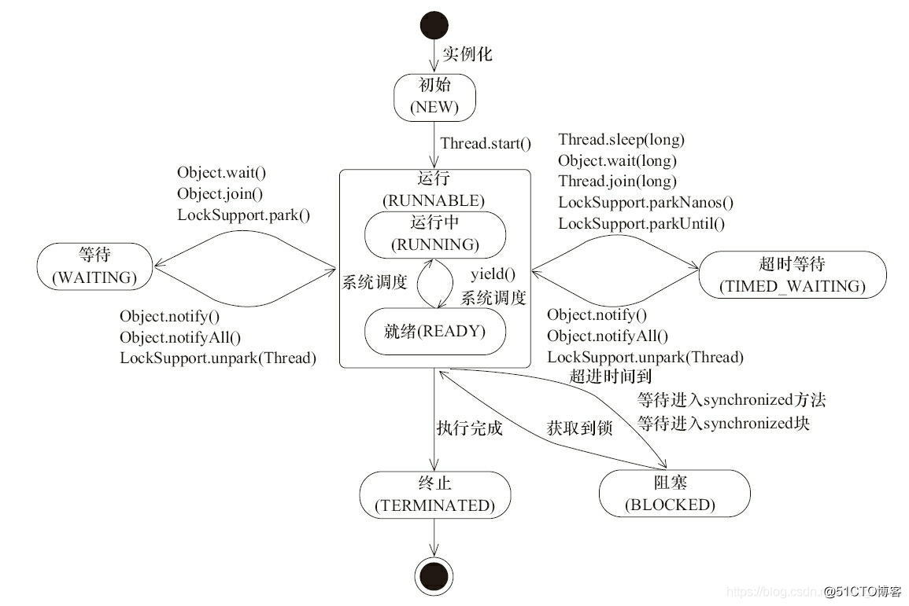

**注意：**sleep方法和wait方法，只是让线程进入等待状态，synchronized方法，才会让线程阻塞

# wait和sleep 区别?

1. 使用 wait时可以主动的唤醒线程，而使用sleep 时不能主动唤醒线程
2. 默认情况下 wait（不传递任何参数或者是参数为0的情况下）它会进入 waiting 状态，而sleep会进入 timed_waiting状态。
3. wait 使用必须配合synchronized一起使用，而sleep 不用
4. wait 是 0bject（对象） 的方法，而sleep是Thread（线程）的方法

```java
public class Test {
    public static void main(String[] args) throws Exception {

        Object lock = new Object();

        Thread t1 = new Thread(() -> {
            synchronized (lock) {
                try {
                    Thread.sleep(100);
                    lock.wait(); // lock锁被释放
                }  // 线程休眠
                catch (Exception e) {e.printStackTrace();}
                System.out.println("t1");
            }
        });
        Thread t2 = new Thread(() -> {
            synchronized (lock) {
                lock.notify();  // 唤醒 lock 对象上休眠的某个线程
                // lock.notifyAll();
            }
            System.out.println("t2");
        });
        Thread t3 = new Thread(() -> System.out.println("t3"));

        t1.start();
        t2.start();
        t3.start();
        /*
            t3
            t2
            t1
        */
    }
}
```

# 线程死锁是如何产生的，如何避免

死锁：由于两个或两个以上的线程相互竞争对方的资源，而同时不释放自己的资源，导致所有线程同时被阻塞。

- 死锁产生的条件：

1. 互斥条件：一个资源在同一时刻只由一个线程占用。
2. 请求与保持条件：一个线程在请求被占资源时发生阻塞，并对已获得的资源保持不放。
3. 循环等待条件：发生死锁时，所有的线程会形成一个死循环，一直阻塞。
4. 不剥夺条件：线程已获得的资源在未使用完不能被其他线程剥夺，只能由自己使用完释放资源。

- 避免死锁的方法主要是破坏死锁产生的条件。

1. 破坏互斥条件：这个条件无法进行破坏，锁的作用就是使他们互斥。
2. 破坏请求与保持条件：一次性申请所有的资源。
3. 破坏循环等待条件：按顺序来申请资源。
4. 破坏不剥夺条件：线程在申请不到所需资源时，主动放弃所持有的资源。

# 活锁、死锁和饥饿

- 活锁：线程等待的资源时间太长，虽然能获取资源，但这个等待的过程相当于活锁了
- 死锁：由于两个或两个以上的线程相互竞争对方的资源，而同时不释放自己的资源，导致所有线程同时被阻塞
- 饥饿：线程一直被其他优先级更高线程抢用资源，导致该线程一直处于饥饿状态

# Java内存的可见性问题

Java的内存模型如下图所示


这里的本地内存并不是真实存在的，只是Java内存模型的一个抽象概念，它包含了控制器、运算器、缓存等。同时Java内存模型规定，线程对共享变量的操作必须在自己的本地内存中进行，不能直接在主内存中操作共享变量。这种内存模型会出现什么问题呢？

1. 线程A获取到共享变量X的值，此时本地内存A中没有X的值，所以加载主内存中的X值并缓存到本地内存A中，线程A修改X的值为1，并将X的值刷新到主内存中，这时主内存及本地内存A中的X的值都为1。
2. 线程B需要获取共享变量X的值，此时本地内存B中没有X的值，加载主内存中的X值并缓存到本地内存B中，此时X的值为1。线程B修改X的值为2，并刷新到主内存中，此时主内存及本地内存B中的X值为2，本地内存A中的X值为1。
3. 线程A再次获取共享变量X的值，此时本地内存中存在X的值，所以直接从本地内存中A获取到了X为1的值，但此时主内存中X的值为2，到此出现了所谓内存不可见的问题。

该问题Java内存模型是通过synchronized关键字和volatile关键字就可以解决。

# volatile的作用是什么?

volatile是一个轻量级的synchronized，一般**作用于变量**，相比于synchronized关键字，volatile关键字的执行成本更低，效率更高

1. 可以保证了内存的可见性
2. 禁止指令重排序

**注意：** volatile 只能保证原子的可见性，不能保证原子性，原子性操作需要用 synchronized

# 指令重排序

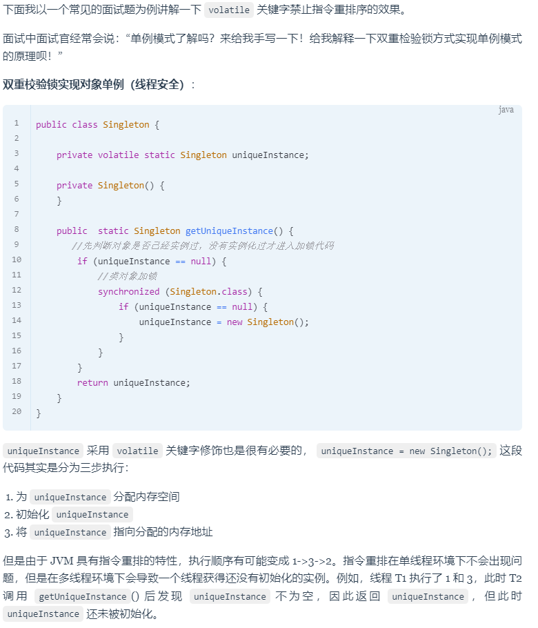

# volatile和synchronized的区别？

1. volatile主要是保证内存的可见性，即变量在寄存器中的内存是不确定的，需要从主存中读取。synchronized主要是解决多个线程访问资源的同步性。
2. volatile作用于变量，synchronized作用于代码块或者方法。
3. volatile仅可以保证数据的可见性，不能保证数据的原子性。synchronized可以保证数据的可见性和原子性。
4. volatile不会造成线程的阻塞，synchronized会造成线程的阻塞。

# synchronized方法锁、对象锁、类锁区别

1. synchronized 方法锁（也叫对象锁），锁的是实例化对象 this
2. synchronized 锁到静态方法上就是类锁，锁的是类的 class

# synchronized 和 Lock 的区别

1. Syncronized 是Java 中的一个关键字，存在于 JVM 层面，Lock 是 Java 中的一个接口
2. Syncronized 执行完同步代码块会自动释放锁，Lock需要手动调用 unlock 释放锁。发生异常，Syncronized也可以自动释放锁，Lock 必须在 finally 关键字中释放锁，不然容易造成线程死锁
3. synchronized的锁可重入、不可中断、非公平，而Lock锁可重入、可中断、可公平
4. Lock锁的范围是块，而synchronized可以锁住块、对象、类
5. Lock锁适合大量代码同步的问题，synchronized锁适合少量代码的同步问题。

[【面试题】synchronized和Lock锁的区别 - 楼兰胡杨 - 博客园](https://www.cnblogs.com/east7/p/15027766.html)

[Java-技术专题-Synchronized和lock区别_Java_洛神灬殇_InfoQ写作社区](https://xie.infoq.cn/article/4e370ded27e4419d2a94a44b3)

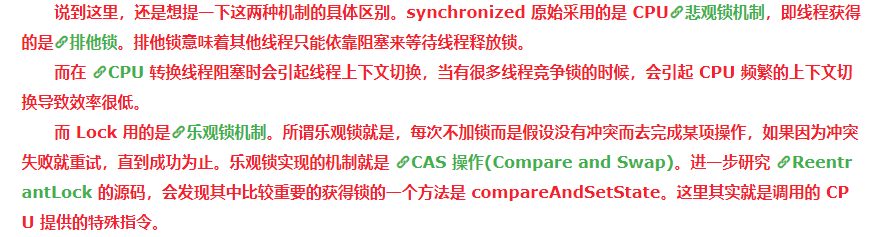


# synchronized 和 Lock 使用的区别

```java
public class Counter {
    private int count = 0;

    public int getCount() {
        return count;
    }

    public void increment() {
        count++;
    }
}
public class SynchronizedDemo {
    public static void main(String[] args) {
        Counter counter = new Counter();
        Thread t1 = new Thread(() -> {
            for (int i = 0; i < 10000; i++) {
                synchronized (counter) {
                    counter.increment();
                }
            }
        });

        Thread t2 = new Thread(() -> {
            for (int i = 0; i < 10000; i++) {
                synchronized (counter) {
                    counter.increment();
                }
            }
        });

        t1.start();
        t2.start();

        try {
            t1.join();
            t2.join();
        } catch (InterruptedException e) {
            e.printStackTrace();
        }

        System.out.println("Count: " + counter.getCount());
    }
}
import java.util.concurrent.locks.Lock;
import java.util.concurrent.locks.ReentrantLock;

public class LockDemo {
    public static void main(String[] args) {
        Counter counter = new Counter();
        Lock lock = new ReentrantLock();

        Thread t1 = new Thread(() -> {
            for (int i = 0; i < 10000; i++) {
                lock.lock();
                try {
                    counter.increment();
                } finally {
                    lock.unlock();
                }
            }
        });

        Thread t2 = new Thread(() -> {
            for (int i = 0; i < 10000; i++) {
                lock.lock();
                try {
                    counter.increment();
                } finally {
                    lock.unlock();
                }
            }
        });

        t1.start();
        t2.start();

        try {
            t1.join();
            t2.join();
        } catch (InterruptedException e) {
            e.printStackTrace();
        }

        System.out.println("Count: " + counter.getCount());
    }
}
```

# 锁升级原理

锁主要存在四种状态，依次是：**无锁状态、偏向锁状态、轻量级锁状态、重量级锁**状态，他们会随着竞争的激烈而逐渐升级。注意**锁可以升级不可降级**，这种策略是为了提高获得锁和释放锁的效率。

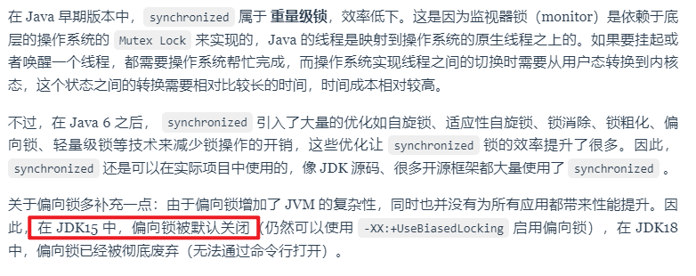

# 锁升级过程

- 偏向锁的获取流程：

1. 检查对象头中Mark Word是否为可偏向状态，如果不是则直接升级为轻量级锁。
2. 如果是，判断Mark Work中的线程ID是否指向当前线程，如果是，则执行同步代码块。
3. 如果不是，则进行CAS操作竞争锁，如果竞争到锁，则将Mark Work中的线程ID设为当前线程ID，执行同步代码块。
4. 如果竞争失败，升级为轻量级锁。

- 轻量锁的获取流程

1. 在线程执行同步代码块之前，JVM会现在当前线程的栈桢中创建用于存储锁记录的空间 Lock Record
2. 将锁对象头中的 markWord 信息复制到锁记录 Lock Record 中，这个官方称为 Displaced Mard Word，然后线程尝试使用 CAS 将对象头中的 MarkWord 替换为指向锁记录的指针
3. CAS 替换成功说明当前线程已获得该锁，此时在栈桢中锁标志位信息也更新为轻量级锁状态：00；如果CAS 替换失败则说明当前时间锁对象已被某个线程占有，那么此时当前线程只有通过自旋的方式去获取锁。如果在自旋一定次数后仍为获得锁，那么轻量级锁将会升级成重量级锁。

- 轻量级锁解锁过程

轻量级锁解锁时，会使用CAS将之前复制在栈桢中的 Displaced Mard Word 替换回 Mark Word 中。如果替换成功，则说明整个过程都成功执行，期间没有其他线程访问同步代码块，恢复到无锁的状态。

但如果替换失败了，表示当前线程在执行同步代码块期间，有其他线程也在访问，当前锁资源是存在竞争的，那么锁将会膨胀成重量级锁。

**补充：**

- Mark Word：存储对象的hashCode、分代年龄和锁标记位
- 对象头结构：

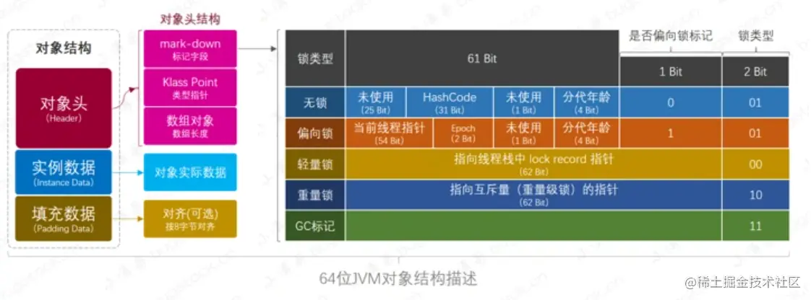

- 锁记录空间：

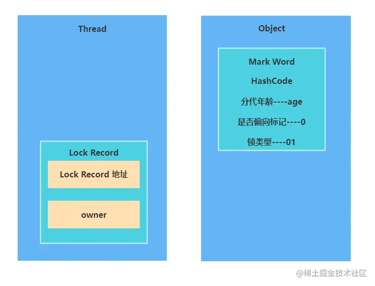

# 锁升级形象化

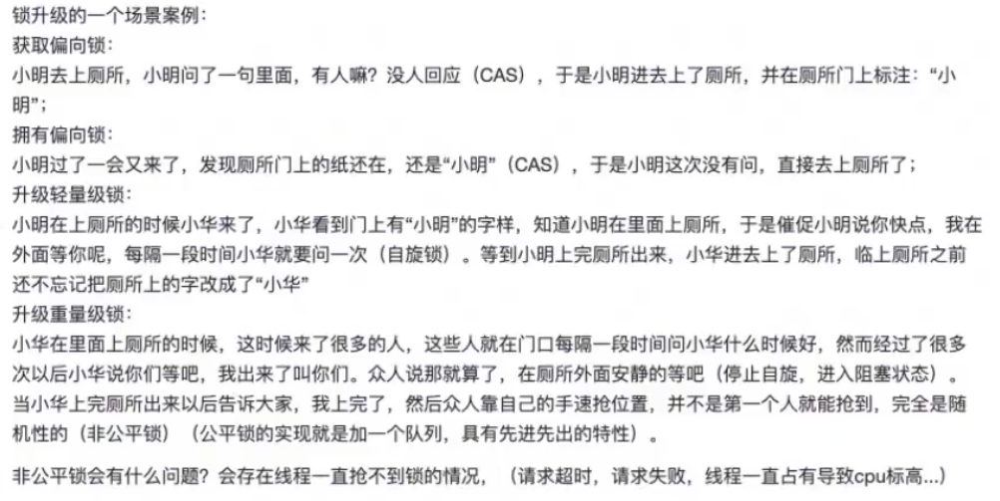

# 可重入锁

synchronized 和 Lock 都是可重入锁

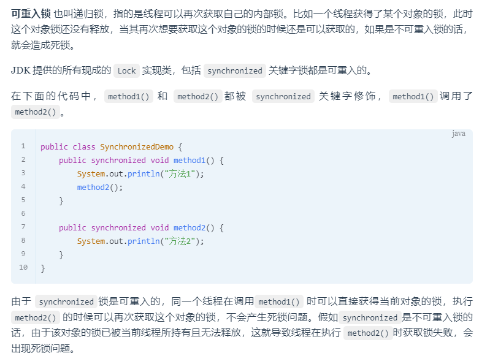

# 公平锁和非公平锁

公平锁：多个线程按照申请锁的顺序来获取锁，符合先进先出

非公平锁：多个线程抢锁，抢到了就直接占有锁


# 可中断锁和不可中断锁

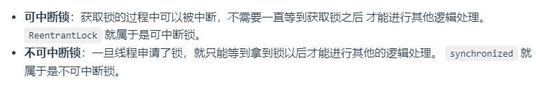

# ThreadLocal


```java
import java.util.concurrent.ExecutorService;
import java.util.concurrent.Executors;

public class ThreadLocalDemo {
    // 创建一个 ThreadLocal 实例，用于存储每个线程的用户信息
    private static final ThreadLocal<User> userThreadLocal = new ThreadLocal<>();
    
    public static void main(String[] args) {
        // 创建固定大小的线程池
        ExecutorService executorService = Executors.newFixedThreadPool(2);
        
        // 提交多个任务到线程池
        for (int i = 0; i < 5; i++) {
            final int taskId = i;
            executorService.submit(() -> {
                try {
                    // 设置当前线程的用户信息
                    User user = new User("User" + taskId);
                    userThreadLocal.set(user);
                    
                    // 模拟业务处理
                    processUser();
                    
                    // 移除 ThreadLocal 中的值（避免内存泄漏）
                    userThreadLocal.remove();
                    System.out.println(Thread.currentThread().getName() + ": 已移除 ThreadLocal 值");
                } catch (Exception e) {
                    e.printStackTrace();
                }
            });
        }
        
        // 关闭线程池
        executorService.shutdown();
    }
    
    private static void processUser() {
        // 从 ThreadLocal 中获取当前线程的用户信息
        User user = userThreadLocal.get();
        System.out.println(Thread.currentThread().getName() + ": 处理用户 " + user.getName());
        
        // 模拟其他操作
        try {
            Thread.sleep(100);
        } catch (InterruptedException e) {
            e.printStackTrace();
        }
    }
    
    // 用户类，存储用户信息
    static class User {
        private String name;
        
        public User(String name) {
            this.name = name;
        }
        
        public String getName() {
            return name;
        }
    }
}
```

# ThreadLocal 原理


[Java并发常见面试题总结（下）](https://javaguide.cn/java/concurrent/java-concurrent-questions-03.html#threadlocal-原理了解吗)

# ThreadLocal 内存泄露问题是怎么导致的？

ThreadLocal的原理是把值存到ThreadLocalMap中，而这个Map的key是弱引用、value是强引用，当key被GC清除掉，而value没有被释放掉就会导致OOM

通常情况下，ThreadLocal是通过`static final`修饰，那么这个引用就是强引用，不会被GC清除掉，但是如果 ThreadLocal放到方法内部定义，并且没有 `static final`修饰，那么就是弱引用，存在GC清除掉的可能。线程又是通过线程池获取的，没有被销毁，所以value的强引用也没有释放掉，线程被反复使用后，存在内存泄露的可能

# 线程间怎么传值

1. `threadLoacd` 每个线程独立的变量空间，不支持 子父线程传递，可线程池之间传递
2. `InheritableThreadLocal`可以子父线程传递，不可线程池之间传递
3. `TransmittableThreadLocal`阿里的，可以子父线程传递，可线程池之间传递

## 线程之间传值用对象和`TransmittableThreadLocal` 区别

如果需要线程之间传递变量，用对象的方式就很方便，TransmittableThreadLocal的优势在于搭建底层框架的时候可以通用，或者适合日志全链路追踪

# 线程池

# 为什么要用线程池

线程池就是事先将多个线程对象放到一个容器中，使用的时候就不用new线程而是直接去池中拿线程即可

从而实现了线程的重复利用，降低了线程的创建和销毁的资源消耗

# 创建线程池的方法


### ThreadPoolExecutor 创建线程池

```java
    /**
     * 用给定的初始参数创建一个新的ThreadPoolExecutor。
     */
    public ThreadPoolExecutor(int corePoolSize,//线程池的核心线程数量
                              int maximumPoolSize,//线程池的最大线程数
                              long keepAliveTime,//当线程数大于核心线程数时，多余的空闲线程存活的最长时间
                              TimeUnit unit,//时间单位
                              BlockingQueue<Runnable> workQueue,//任务队列，用来储存等待执行任务的队列
                              ThreadFactory threadFactory,//线程工厂，用来创建线程，一般默认即可
                              RejectedExecutionHandler handler//拒绝策略，当提交的任务过多而不能及时处理时，我们可以定制策略来处理任务
                               ) {
        if (corePoolSize < 0 ||
            maximumPoolSize <= 0 ||
            maximumPoolSize < corePoolSize ||
            keepAliveTime < 0)
            throw new IllegalArgumentException();
        if (workQueue == null || threadFactory == null || handler == null)
            throw new NullPointerException();
        this.corePoolSize = corePoolSize;
        this.maximumPoolSize = maximumPoolSize;
        this.workQueue = workQueue;
        this.keepAliveTime = unit.toNanos(keepAliveTime);
        this.threadFactory = threadFactory;
        this.handler = handler;
    }
```

### 内置线程池

通过 Executors 可以创建4种常见的线程池

1. newCachedThreadPool：可缓存的线程池
2. newFixedThreadPool：固定大小的线程池
3. newSingleThreadExecutor：单个线程的线程池
4. newScheduledThreadPool：可做调度任务的线程池，也就是可以定时、延时

[Java并发面试题](https://github.com/JsonChao/Awesome-Android-Interview/blob/master/Java相关/Java并发面试题.md)

[Java中常用的四种线程池 - 万猫学社 - 博客园](https://www.cnblogs.com/heihaozi/p/11741735.html)

[5种常用的线程池_常用的线程池有哪些-CSDN博客](https://blog.csdn.net/sc179/article/details/115029531)

### 不推荐使用内置线程池

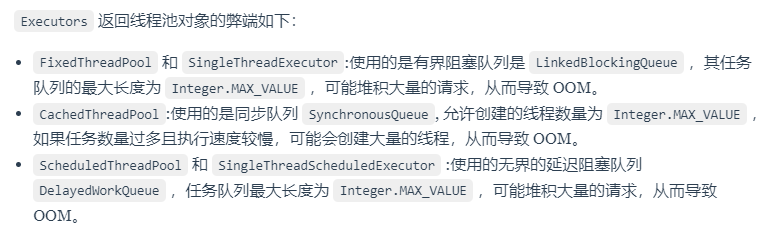

这几种线程池要不就是阻塞队列会无线堆积，要么线程会无线创建，所以存在内存溢出的可能，不能对具体的场景产生具体的定制

[线程池面试连环炮，你能抗住几题？-鸿蒙开发者社区-51CTO.COM](https://ost.51cto.com/posts/13648)

# 线程池处理任务的流程


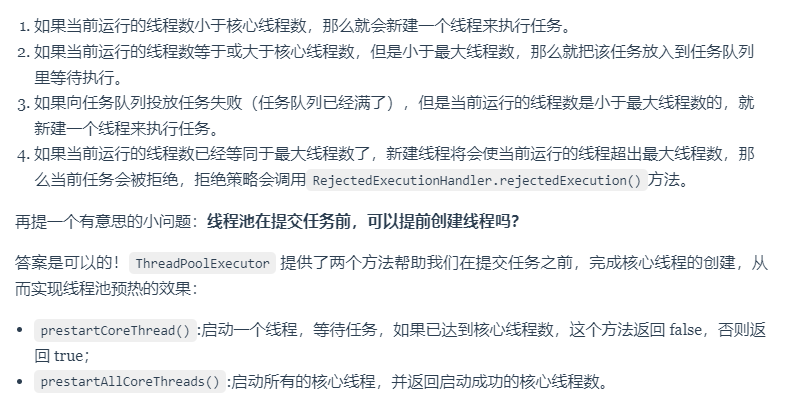

# 线程池的核心线程会被回收吗

`ThreadPoolExecutor` 默认不会回收核心线程，即使它们已经空闲了。这是为了减少创建线程的开销，因为核心线程通常是要长期保持活跃的。

但是，如果线程池是被用于周期性使用的场景，且频率不高（周期之间有明显的空闲时间），可以考虑将 `allowCoreThreadTimeOut(boolean value)` 方法的参数设置为 `true`，这样就会回收空闲（时间间隔由 `keepAliveTime` 指定）的核心线程了。

# 线程池的拒绝策略有哪些

1. `ThreadPoolExecutor.AbortPolicy`：抛出异常来拒绝新任务的处理【默认】。
2. `ThreadPoolExecutor.CallerRunsPolicy`：调用执行自己的线程运行任务，也就是直接在调用`execute`方法的线程中运行(`run`)被拒绝的任务，如果未空闲会延迟等待，即使出现空闲线程也不会切换。因此**这种策略会降低对于新任务提交速度，但是任何适合不允许丢弃任务的场景**。如果你的应用程序可以承受此延迟并且你要求任何一个任务请求都要被执行的话，你可以选择这个策略。
3. `ThreadPoolExecutor.DiscardPolicy`：不处理新任务，直接丢弃掉。
4. `ThreadPoolExecutor.DiscardOldestPolicy`：此策略将丢弃最早的未处理的任务请求。

### CallerRunsPolicy 拒绝策略 Demo 实践

CallerRunsPolicy 会调用执行自己的线程运行任务，如果是main函数主线程的话，可能会导致主线程阻塞

```java
public class ThreadPoolTest {

    private static final Logger log = LoggerFactory.getLogger(ThreadPoolTest.class);

    public static void main(String[] args) {
        // 创建一个线程池，核心线程数为1，最大线程数为2
        // 当线程数大于核心线程数时，多余的空闲线程存活的最长时间为60秒，
        // 任务队列为容量为1的ArrayBlockingQueue，饱和策略为CallerRunsPolicy。
        ThreadPoolExecutor threadPoolExecutor = new ThreadPoolExecutor(1,
                2,
                60,
                TimeUnit.SECONDS,
                new ArrayBlockingQueue<>(1),
                new ThreadPoolExecutor.CallerRunsPolicy());

        // 提交第一个任务，由核心线程执行
        threadPoolExecutor.execute(() -> {
            log.info("核心线程执行第一个任务");
            ThreadUtil.sleep(1, TimeUnit.SECONDS);

            threadPoolExecutor.execute(() -> {
                log.info("核心线程执行第六个任务");
                ThreadUtil.sleep(1, TimeUnit.SECONDS);
            });

            threadPoolExecutor.execute(() -> {
                log.info("核心线程执行第七个任务");
                ThreadUtil.sleep(1, TimeUnit.SECONDS);
            });
        });

        // 提交第二个任务，由于核心线程被占用，任务将进入队列等待
        threadPoolExecutor.execute(() -> {
            log.info("核心线程处理入队的第二个任务");
        });

        // 提交第三个任务，由于核心线程被占用且队列已满，创建非核心线程处理
        threadPoolExecutor.execute(() -> {
            log.info("非核任务心线程处理第三个");
            ThreadUtil.sleep(1, TimeUnit.SECONDS);

            threadPoolExecutor.execute(() -> {
                log.info("非核心线程执行第八个任务");
                ThreadUtil.sleep(1, TimeUnit.SECONDS);
            });

            threadPoolExecutor.execute(() -> {
                log.info("非核心线程执行第九个任务");
                ThreadUtil.sleep(2, TimeUnit.SECONDS);
            });
        });

        // 提交第四个任务，由于核心线程和非核心线程都被占用，队列也满了，根据CallerRunsPolicy策略，任务将由提交任务的线程（即主线程）来执行
        threadPoolExecutor.execute(() -> {
            log.info("主线程处理第四个任务");
            ThreadUtil.sleep(1, TimeUnit.SECONDS);
        });

        // 提交第五个任务，主线程被第四个任务卡住，该任务必须等到主线程执行完才能提交
        threadPoolExecutor.execute(() -> {
            log.info("主线程执行第五个任务");
            ThreadUtil.sleep(5, TimeUnit.SECONDS);  // 让主线程多等一会，防止线程池被关闭了
        });

        // 关闭线程池
        threadPoolExecutor.shutdown();
    }
}
```

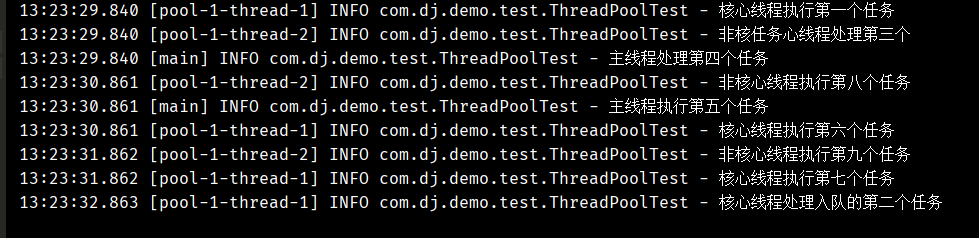

# 阻塞队列有哪些

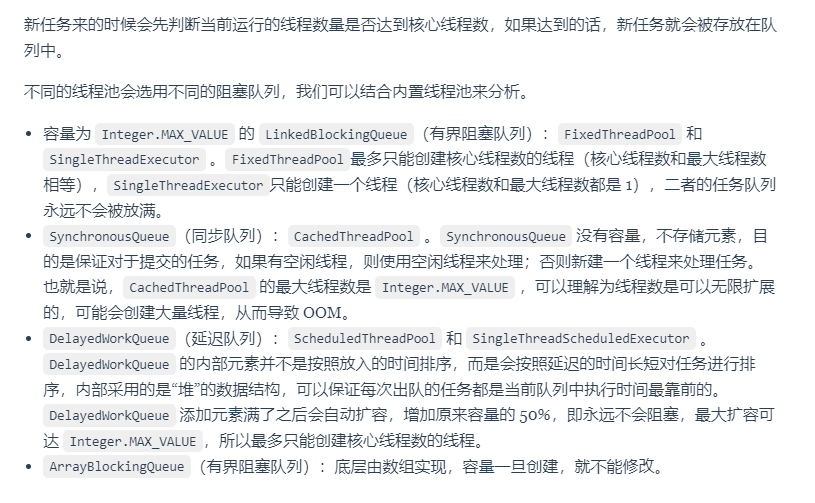

# 线程池中线程异常后，销毁还是复用

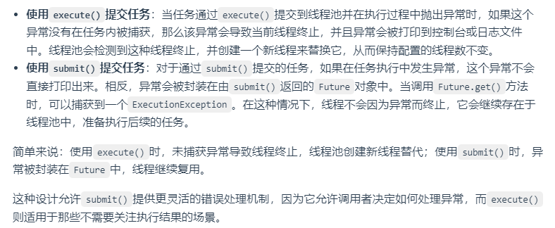

# shutdownNow() 和 shutdown() 两个方法有什么区别？

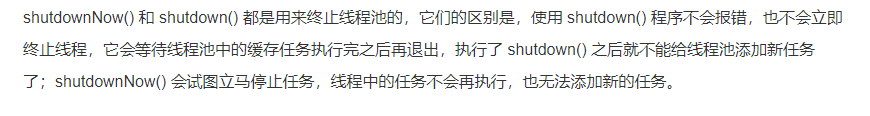

[线程池面试连环炮，你能抗住几题？-鸿蒙开发者社区-51CTO.COM](https://ost.51cto.com/posts/13648)

### **调用了shutdownNow或者shutdown，线程一定会退出么**


# 如何设定线程池的大小？

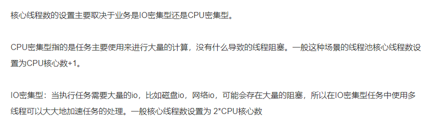

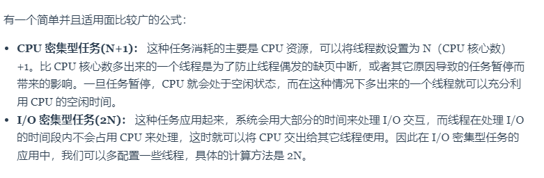

threadLoacd 每个线程独立的变量空间，不支持 子父线程传递，可线程池之间传递 InheritableThreadLocal  可以子父线程传递，不可线程池之间传递 TransmittableThreadLocal 阿里的，可以子父线程传递，可线程池之间传递