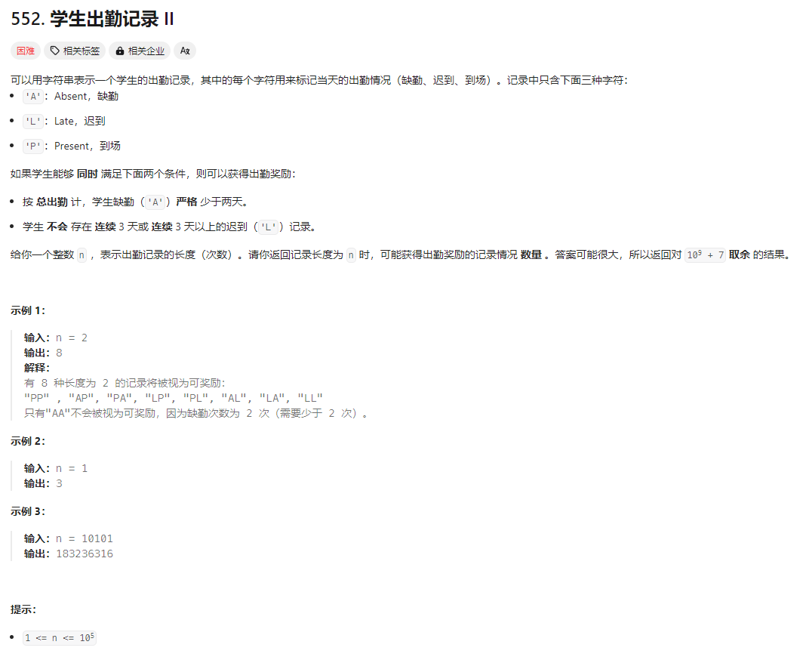
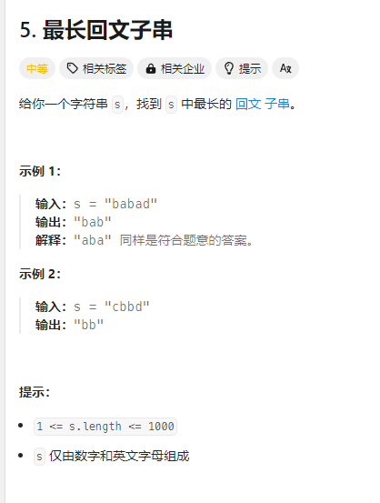
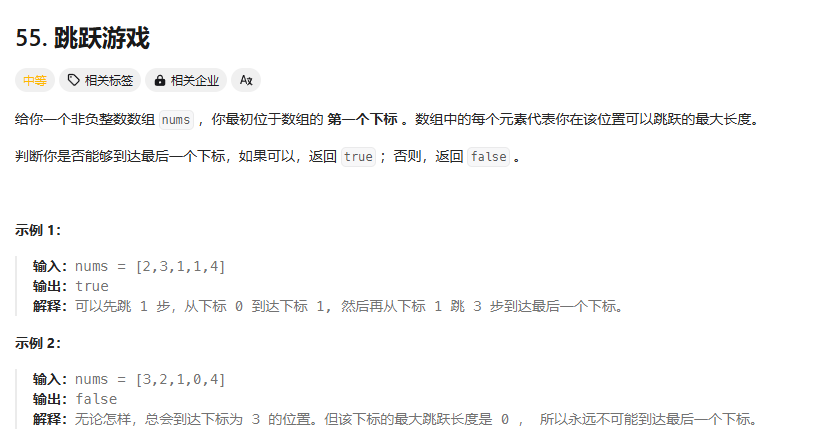

# 两数相加

 

```java
/**
 * Definition for singly-linked list.
 * public class ListNode {
 * int val;
 * ListNode next;
 * ListNode() {}
 * ListNode(int val) { this.val = val; }
 * ListNode(int val, ListNode next) { this.val = val; this.next = next; }
 * }
 */
class Solution {
    public ListNode addTwoNumbers(ListNode l1, ListNode l2) {

        ListNode dummyHead = new ListNode(0); // 创建一个虚拟头节点
        ListNode current = dummyHead; // 当前节点指向虚拟头节点
        int carry = 0; // 进位

        // 遍历两个链表，直到两个链表都为空
        while (l1 != null || l2 != null) {
            int x = (l1 != null) ? l1.val : 0; // 获取l1的值
            int y = (l2 != null) ? l2.val : 0; // 获取l2的值

            int sum = x + y + carry; // 计算当前位的和
            carry = sum / 10; // 更新进位
            current.next = new ListNode(sum % 10); // 创建新节点并添加到结果链表
            current = current.next; // 移动到下一个节点

            // 移动到下一个链表节点
            if (l1 != null) l1 = l1.next;
            if (l2 != null) l2 = l2.next;
        }

        // 如果还有进位，添加一个新节点
        if (carry > 0) {
            current.next = new ListNode(carry);
        }

        return dummyHead.next; // 返回结果链表的头节点
    }

}
```

# 字符串相乘

 

普通的相乘会导致int超过最大值2^32 - 1= 4,294,967,296 - 1

 

```java
public class StringMultiplication {
    public String multiply(String num1, String num2) {
        // 特殊情况处理
        if (num1.equals("0") || num2.equals("0")) {
            return "0";
        }

        int len1 = num1.length();
        int len2 = num2.length();
        int[] result = new int[len1 + len2]; // 结果数组

        // 反向遍历两个字符串
        for (int i = len1 - 1; i >= 0; i--) {
            for (int j = len2 - 1; j >= 0; j--) {
                int mul = (num1.charAt(i) - '0') * (num2.charAt(j) - '0');
                int sum = mul + result[i + j + 1]; // 加上之前的值

                result[i + j + 1] = sum % 10; // 当前位
                result[i + j] += sum / 10; // 进位
            }
        }

        // 构建结果字符串
        StringBuilder sb = new StringBuilder();
        for (int num : result) {
            if (!(sb.length() == 0 && num == 0)) { // 跳过前导零
                sb.append(num);
            }
        }

        return sb.toString();
    }

    public static void main(String[] args) {
        StringMultiplication sm = new StringMultiplication();
        String num1 = "123";
        String num2 = "456";
        String result = sm.multiply(num1, num2);
        System.out.println("乘积: " + result); // 输出: 乘积: 56088
    }
}
```

# 有效的括号

 

```java
class Solution {
    public boolean isValid(String s) {
        int length = s.length();
        ArrayList<Character> fh = new ArrayList();
        for (int i = 0; i < length; i++) {
            char t = s.charAt(i);
            if (t == '(')
                fh.add(')');
            if (t == '[')
                fh.add(']');
            if (t == '{')
                fh.add('}');
            if (t == ')' || t == ']' || t == '}') {
                int size = fh.size();
                if (size == 0)
                    return false;
                char tt = fh.remove(size - 1);
                if (t != tt)
                    return false;
            }
        }

        return fh.size() == 0;
    }
}
```

# 学生出勤记录 II

 

```java
class Solution {
    public int checkRecord(int n) {
        final int MOD = 1000000007;
        int[][][] dp = new int[n + 1][2][3]; // 长度，A 的数量，结尾连续 L 的数量 【注意是结尾而不是存在】
        dp[0][0][0] = 1;
        for (int i = 1; i <= n; i++) {
            // 以 P 结尾的数量
            for (int j = 0; j <= 1; j++) {
                for (int k = 0; k <= 2; k++) {
                    dp[i][j][0] = (dp[i][j][0] + dp[i - 1][j][k]) % MOD;
                }
            }
            // 以 A 结尾的数量
            for (int k = 0; k <= 2; k++) {
                dp[i][1][0] = (dp[i][1][0] + dp[i - 1][0][k]) % MOD;
            }
            // 以 L 结尾的数量
            for (int j = 0; j <= 1; j++) {
                for (int k = 1; k <= 2; k++) {
                    dp[i][j][k] = (dp[i][j][k] + dp[i - 1][j][k - 1]) % MOD;
                }
            }
        }
        int sum = 0;
        for (int j = 0; j <= 1; j++) {
            for (int k = 0; k <= 2; k++) {
                sum = (sum + dp[n][j][k]) % MOD;
            }
        }
        return sum;
    }
}
```

# 判断一个数是否为素数

 

# 斐波拉数列

 

# 最长公共前缀

 

```java
class Solution {
    public String longestCommonPrefix(String[] strs) {
        String frist = strs[0];
        int mix = frist.length();
        if (mix == 0)
            return "";
        for (int i = 1; i < strs.length; i++) {
            String str = strs[i];
            int mm = 0;

            for (int j = 0; j < mix && j < str.length(); j++) {
                if (frist.charAt(j) == str.charAt(j)) mm++;
                else break;
            }
            mix = Math.min(mix, mm);
        }

        if (mix == 0)
            return "";
        else
            return frist.substring(0, mix);
    }
}
```

# 最长回文子串

 

```java
class Solution {
    public static String longestPalindrome(String s) {
        if (s == null || s.length() < 1) {
            return "";
        }

        int start = 0, end = 0;

        for (int i = 0; i < s.length(); i++) {
            // 以 s[i] 为中心扩展（奇数长度回文）
            int len1 = expandAroundCenter(s, i, i);
            // 以 s[i] 和 s[i + 1] 为中心扩展（偶数长度回文）
            int len2 = expandAroundCenter(s, i, i + 1);
            // 取最大长度
            int len = Math.max(len1, len2);
            if (len > end - start) {
                start = i - (len - 1) / 2;
                end = i + len / 2;
            }
        }

        return s.substring(start, end + 1);
    }

    private static int expandAroundCenter(String s, int left, int right) {
        while (left >= 0 && right < s.length() && s.charAt(left) == s.charAt(right)) {
            left--;
            right++;
        }
        // 返回回文的长度
        return right - left - 1;
    }
}
```

# 无重复字符的最长子串

 

**使用滑动窗口算法**

```java
class Solution {
    public static int lengthOfLongestSubstring(String s) {
        int n = s.length();
        HashMap<Character, Integer> map = new HashMap<>();
        int maxLength = 0;
        for (int left = 0, right = 0; right < n; right++) {
            char currentChar = s.charAt(right);
            if (map.containsKey(currentChar)) {
                left = Math.max(left, map.get(currentChar) + 1);
            }
            map.put(currentChar, right);
            maxLength = Math.max(maxLength, right - left + 1);
        }
        return maxLength;
    }
}
```

# 最长回文串

 

```java
class Solution {
    public int longestPalindrome(String s) {
        ArrayList list = new ArrayList<Character>();
        int count = 0;
        for (Character c : s.toCharArray()) {
            if (list.contains(c)) {
                list.remove(list.indexOf(c));
                count += 2;
            }
            else {
                list.add(c);
            }
        }
        return (list.size() > 0) ? count + 1 : count;
    }
}
```

# 最长回文子序列

 

**动态规划**

```java
class Solution {
    public int longestPalindromeSubseq(String s) {
        int len = s.length();
        int[][] dp = new int[len][len];

        // 初始化对角线元素
        for (int i = 0; i < len; i++) {
            dp[i][i] = 1;
        }

        // 从后往前遍历字符串
        for (int i = len - 1; i >= 0; i--) {
            for (int j = i + 1; j < len; j++) {
                if (s.charAt(i) == s.charAt(j)) {
                    // 当两个字符相等时，加上两边的字符
                    dp[i][j] = dp[i + 1][j - 1] + 2;
                } else {
                    // 当两个字符不等时，取左右两侧的最大值
                    dp[i][j] = Math.max(dp[i + 1][j], dp[i][j - 1]);
                }
            }
        }

        // 返回整个字符串的最长回文子序列长度
        return dp[0][len - 1];
    }
}
```

# 回文子串

 

```java
class Solution {
       public int countSubstrings(String s) {
           int n = s.length();
           int count = 0;
           boolean[][] dp = new boolean[n][n];
           for (int i = n - 1; i >= 0; i--) {
               for (int j = i; j < n; j++) {
                   if (s.charAt(i) == s.charAt(j) && (j - i <= 1 || dp[i + 1][j - 1])) {
                       dp[i][j] = true;
                       count++;
                   }
               }
           }
           return count;
       }
   }
```

# 字符串转换整数 (atoi)

 

 

 

```java
class Solution {

    public int myAtoi(String s) {
        s = s.trim();
        if (s.isEmpty()) {
            return 0;
        }
        int sign = 1;
        int index = 0;
        if (s.charAt(index) == '-' || s.charAt(index) == '+') {
            sign = s.charAt(index++) == '-'? -1 : 1;
        }
        int result = 0;
        while (index < s.length() && Character. (s.charAt(index))) {
            int digit = s.charAt(index++) - '0';
            if (result > Integer.MAX_VALUE / 10 || (result == Integer.MAX_VALUE / 10 && digit > Integer.MAX_VALUE % 10)) {
                return sign == 1? Integer.MAX_VALUE : Integer.MIN_VALUE;
            }
            result = result * 10 + digit;
        }
        return result * sign;
    }
}
```

# 使用最小花费爬楼梯


```java
class Solution {
    public int minCostClimbingStairs(int[] cost) {
        int n = cost.length;
        int[] dp = new int[n + 1];
        dp[0] = 0;
        dp[1] = 0;
        for (int i = 2; i <= n; i++) {
            dp[i] = Math.min(dp[i - 1] + cost[i - 1], dp[i - 2] + cost[i - 2]);
        }
        return dp[n];
    }
}
```

# 分割等和子集


```java
class Solution {
       public boolean canPartition(int[] nums) {
           int sum = 0;
           for (int num : nums) {
               sum += num;
           }
           if (sum % 2 == 1) {
               return false;
           }
           int target = sum / 2;
           boolean[][] dp = new boolean[nums.length + 1][target + 1];
           // 初始化，当不选任何元素时，和为0是可以达到的
           for (int i = 0; i <= nums.length; i++) {
               dp[i][0] = true;
           }
           for (int i = 1; i <= nums.length; i++) {
               for (int j = 1; j <= target; j++) {
                   dp[i][j] = dp[i - 1][j];
                   if (j >= nums[i - 1]) {
                       dp[i][j] = dp[i][j] || dp[i - 1][j - nums[i - 1]];
                   }
               }
           }
           return dp[nums.length][target];
       }
   }
```

# 组合

 

```java
import java.util.ArrayList;
   import java.util.List;

   class Solution {
       private List<List<Integer>> result = new ArrayList<>();
       private List<Integer> path = new ArrayList<>();

       public List<List<Integer>> combine(int n, int k) {
           backtrack(1, n, k);
           return result;
       }

       private void backtrack(int start, int n, int k) {
           if (path.size() == k) {
               result.add(new ArrayList<>(path));
               return;
           }
           for (int i = start; i <= n; i++) {
               path.add(i);
               backtrack(i + 1, n, k);
               path.remove(path.size() - 1);
           }
       }
   }
```

# **分发饼干**


```java
class Solution {
 public int findContentChildren(int[] g, int[] s) {
        // 对孩子的胃口值和饼干的尺寸进行排序
        Arrays.sort(g);
        Arrays.sort(s);
        
        int childIndex = 0; // 孩子指针
        int cookieIndex = 0; // 饼干指针
        
        // 遍历孩子和饼干
        while (childIndex < g.length && cookieIndex < s.length) {
            // 如果当前饼干满足当前孩子的胃口
            if (s[cookieIndex] >= g[childIndex]) {
                childIndex++; // 满足一个孩子，移动到下一个孩子
            }
            cookieIndex++; // 移动到下一个饼干
        }
        
        return childIndex; // 返回满足的孩子数量
    }
}
```

# 买卖股票的最佳时机


```java
class Solution {
    public int maxProfit(int[] prices) {
        int minPrice = Integer.MAX_VALUE;
        int maxProfit = 0; // 初始化最大利润为0

        for (int i = 0; i < prices.length; i++) {
            // 更新最小价格
            minPrice = Math.min(minPrice, prices[i]);
            // 计算当前价格下能获取的利润，并更新最大利润
            maxProfit = Math.max(maxProfit, prices[i] - minPrice);
        }

        return maxProfit;
    }
}
```

# 买卖股票的最佳时机II


```java
class Solution {
    public int maxProfit(int[] prices) {
        int maxProfit = 0; // 初始化最大利润为0

        // 遍历价格数组
        for (int i = 1; i < prices.length; i++) {
            // 如果今天的价格高于昨天的价格
            if (prices[i] > prices[i - 1]) {
                // 计算利润并累加到最大利润中
                maxProfit += prices[i] - prices[i - 1];
            }
        }

        return maxProfit; // 返回最大利润
    }
}
```

# 零钱兑换


```java
class Solution {
    public int coinChange(int[] coins, int amount) {
        // 初始化 dp 数组
        int[] dp = new int[amount + 1];
        // 设置初始值为一个较大的数
        for (int i = 1; i <= amount; i++) {
            dp[i] = amount + 1;
        }

        // 动态规划填充 dp 数组
        dp[0] = 0; // 凑成金额 0 不需要任何硬币
        for (int coin : coins) {
            for (int i = coin; i <= amount; i++) {
                dp[i] = Math.min(dp[i], dp[i - coin] + 1);
            }
        }

        // 如果 dp[amount] 没有被更新，返回 -1
        return dp[amount] == amount + 1 ? -1 : dp[amount];
    }
}
```

# **跳跃游戏**



```java
class Solution {
    public boolean canJump(int[] nums) {

        int maxReach = 0; // 初始化可以到达的最远位置

        // 遍历数组
        for (int i = 0; i < nums.length; i++) {
            // 如果当前索引大于最大可达位置，说明无法到达该位置
            if (i > maxReach) {
                return false;
            }
            // 更新最大可达位置
            maxReach = Math.max(maxReach, i + nums[i]);
            // 如果最大可达位置已经超过或等于最后一个下标，返回 true
            if (maxReach >= nums.length - 1) {
                return true;
            }
        }

        return false; // 如果遍历结束仍无法到达最后一个下标，返回 false
    }
}
```

# **跳跃游戏II**


```java
class Solution {
    public int jump(int[] nums) {
        int jumps = 0; // 跳跃次数
        int currentEnd = 0; // 当前跳跃的覆盖范围
        int farthest = 0; // 下一步可以达到的最远距离

        // 遍历到倒数第二个元素，因为最后一个元素不需要再跳跃
        for (int i = 0; i < nums.length - 1; i++) {
            // 更新下一步可以达到的最远距离
            farthest = Math.max(farthest, i + nums[i]);

            // 如果到达当前跳跃的覆盖范围的末尾，增加跳跃次数，并更新当前覆盖范围
            if (i == currentEnd) {
                jumps++;
                currentEnd = farthest; // 更新当前覆盖范围为下一步可以达到的最远距离

                // 如果当前覆盖范围已经超过或等于最后一个下标，直接返回跳跃次数
                if (currentEnd >= nums.length - 1) {
                    return jumps;
                }
            }
        }

        return jumps; // 返回跳跃次数
    }
}
```

# **复原 IP 地址**


```java
public class RestoreIPAddresses {
    public static List<String> restoreIpAddresses(String s) {
        List<String> result = new ArrayList<>();
        if (s == null || s.length() < 4 || s.length() > 12) {
            return result;
        }
        backtrack(s, 0, new ArrayList<>(), result);
        return result;
    }

    private static void backtrack(String s, int start, List<String> current, List<String> result) {
        // 如果已经有4个分段且用完所有字符，加入结果集
        if (current.size() == 4 && start == s.length()) {
            result.add(String.join(".", current));
            return;
        }
        // 如果分段数超过4或字符已用完，终止回溯
        if (current.size() == 4 || start == s.length()) {
            return;
        }

        // 尝试每个可能的分段长度（1-3位）
        for (int len = 1; len <= 3 && start + len <= s.length(); len++) {
            String segment = s.substring(start, start + len);
            // 检查分段是否有效
            if (isValidSegment(segment)) {
                current.add(segment);
                backtrack(s, start + len, current, result);
                current.remove(current.size() - 1); // 回溯
            }
        }
    }

    private static boolean isValidSegment(String segment) {
        // 长度检查
        if (segment.isEmpty() || segment.length() > 3) {
            return false;
        }
        // 前导零检查：如果长度大于1且以0开头，则无效
        if (segment.length() > 1 && segment.charAt(0) == '0') {
            return false;
        }
        // 数值范围检查
        int num = Integer.parseInt(segment);
        return num >= 0 && num <= 255;
    }

    public static void main(String[] args) {
        System.out.println(restoreIpAddresses("25525511135")); // 输出: [255.255.11.135, 255.255.111.35]
        System.out.println(restoreIpAddresses("0000"));       // 输出: [0.0.0.0]
        System.out.println(restoreIpAddresses("010010"));     // 输出: [0.10.0.10, 0.100.1.0]
    }
}
```